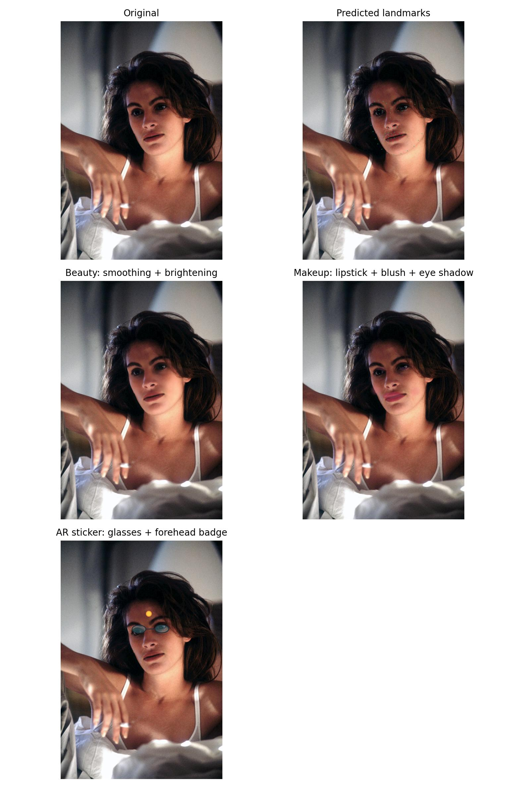
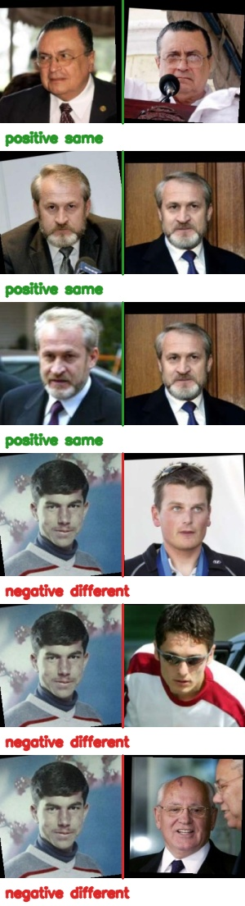
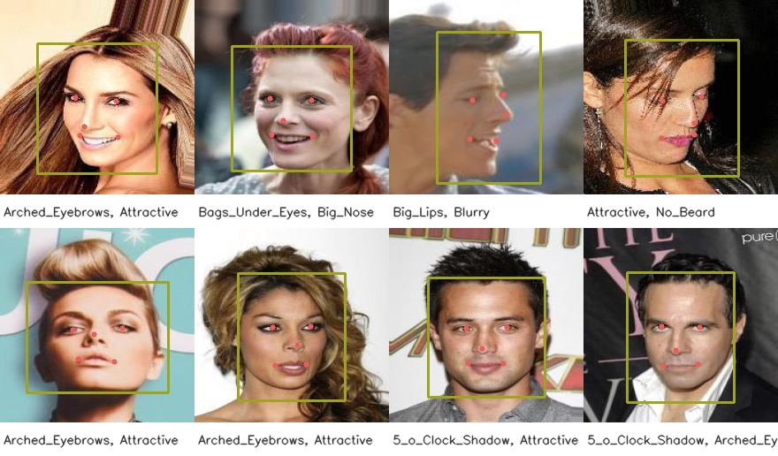
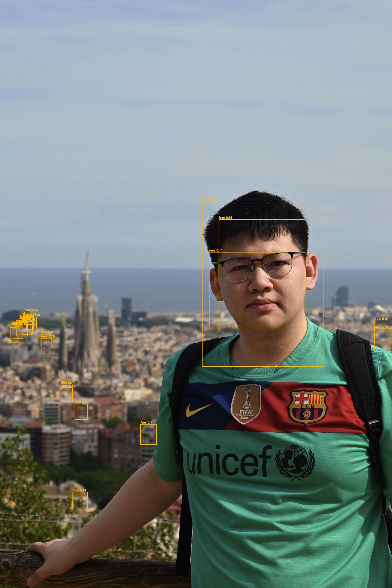
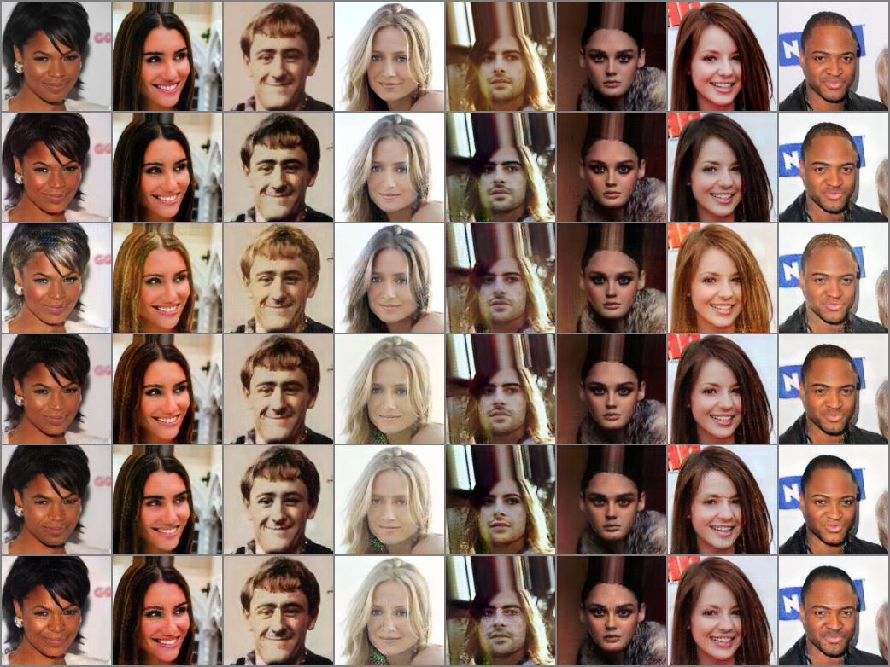
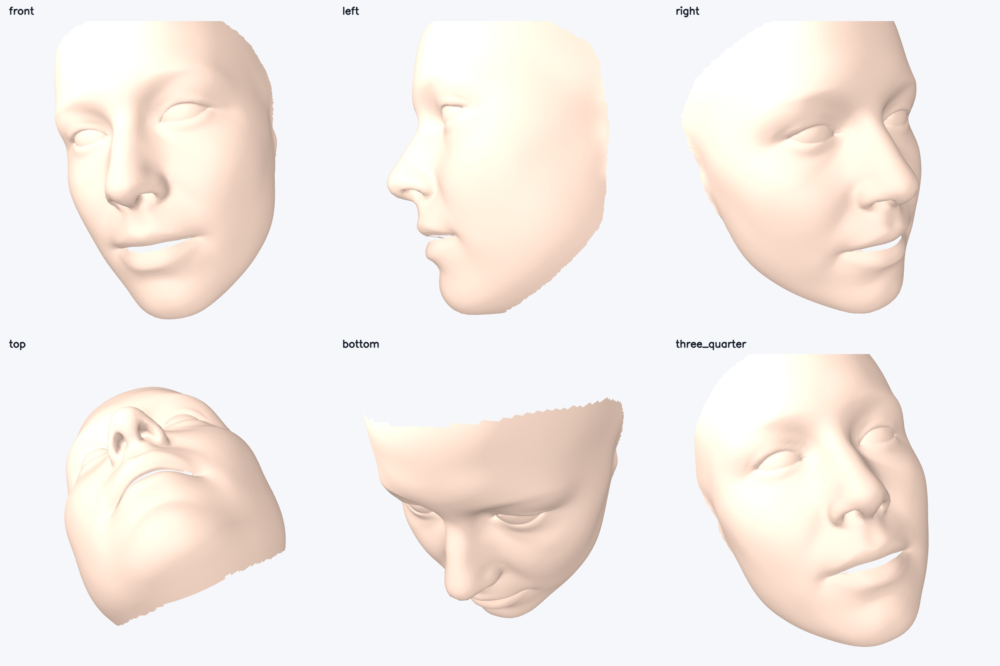
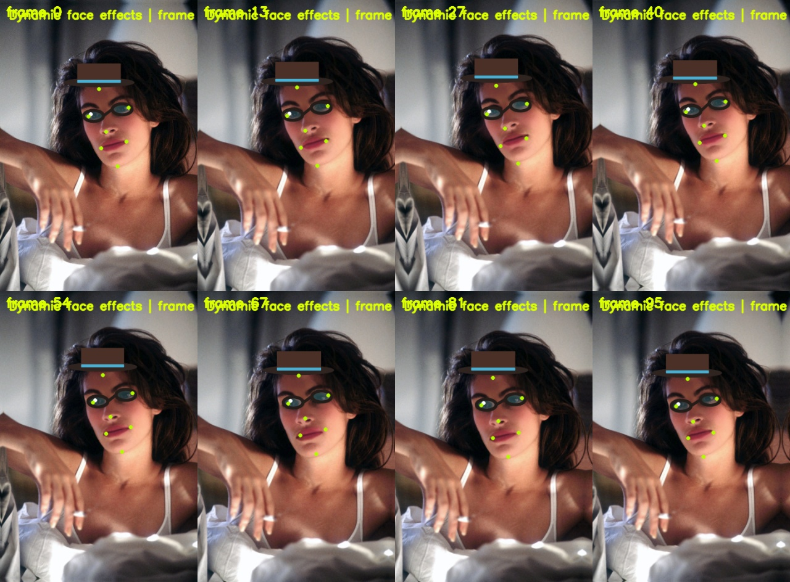

# Face AI Project

An end-to-end computer vision project for face analysis, identity recognition,
attribute editing, 3D reconstruction, and dynamic visual effects. The repository
keeps the full engineering path: dataset inspection, model training, evaluation,
optimization, rendering, and a unified demo page built from real local artifacts.



## Highlights

| Area | Implementation | Result snapshot |
|---|---|---|
| Dataset analysis | LFW and CelebA parsers, label statistics, pair protocol inspection, OpenCV/Matplotlib visualization | LFW: 13,233 images / 5,749 identities; CelebA: 202,599 images / 40 attributes |
| Face detection | MMDetection RetinaNet workflow on WIDER FACE plus OpenCV baseline | WIDER FACE debug run AP50: 0.3283 |
| Landmarks and alignment | 300W 68-point regressor, five-point extraction, calibrated affine alignment | Best validation NME: 0.1721 |
| Face recognition | ResNet50/IResNet50 + ArcFace, MS1M aligned subset, LFW 10-fold verification | Closed-set validation: 97.94%; LFW self-trained run: 76.98%; FaceNet reference: 96.77% |
| Model optimization | PyTorch dynamic quantization and ONNXRuntime export/inference check | 20.21% smaller; CPU latency speedup around 1.17x |
| Attribute editing | StarGAN on aligned CelebA for hair color, gender, and age-related controls | 100,000 images, 30-epoch refined run, FID 66.40, IS 2.178 |
| 3D reconstruction | Official 3DDFA_V2 integration and OpenGL multi-view rendering | 38,365 vertices, 76,073 triangles, six-view render grid |
| Dynamic effects | Dense landmark tracking, smoothing, AR stickers, beauty filter, makeup, video composition | 96-frame MP4 at 24 FPS, 6.66 FPS processing throughput |

## Visual Tour

### Data And Detection

| LFW pair exploration | CelebA annotation check | WIDER FACE debug detection |
|---|---|---|
|  |  |  |

### Geometry And Recognition

| 300W landmark prediction | GT vs predicted alignment | ArcFace training curve |
|---|---|---|
|  |  |  |

### Editing, 3D, And Effects

| StarGAN refined output | 3DDFA_V2 OpenGL render | Dynamic effects contact sheet |
|---|---|---|
|  |  |  |

## Unified Demo

Generate a local dashboard that indexes the actual images, videos, meshes, metric
files, checkpoints, and source entry points:

```powershell
conda activate ml-gpu
python src/app/final_demo.py --serve --open
```

The generated page is written to:

```text
outputs/final_demo/index.html
```

## Repository Layout

```text
configs/              MMDetection configs and reproducible settings
docs/                 Environment notes, algorithm notes, and run books
models/               Local checkpoints and exported models, ignored by Git
outputs/              Selected metrics, images, videos, meshes, and demo assets
scripts/              Utility commands for setup and dataset handling
src/
  app/                 Unified demo generator
  datasets/            LFW, CelebA, WIDER FACE, MS1M preparation and exploration
  detection/           OpenCV face detection baseline
  mmdetection/         WIDER FACE detection training and evaluation
  landmarks/           300W landmark training, visualization, and alignment
  recognition/         ArcFace training and LFW verification
  optimization/        Quantization, ONNX export, and runtime checks
  stargan/             CelebA attribute editing training, sampling, and quality checks
  reconstruction/      3DDFA_V2 reconstruction and OpenGL rendering
  effects/             Static and dynamic face effects
third_party/           External repositories used locally, excluded when large
```

## Main Commands

```powershell
# Final dashboard
python src/app/final_demo.py

# Dataset exploration
python src/datasets/explore_lfw.py --help
python src/datasets/explore_lfw_pairs.py --help
python src/datasets/explore_celeba.py --help

# Detection
python src/mmdetection/run_face_detection_mmdet.py --help
python src/mmdetection/train_widerface.py --help
python src/mmdetection/evaluate_widerface.py --help

# Landmarks and alignment
python src/landmarks/train_landmark_regressor.py --help
python src/landmarks/align_with_landmark_model.py --help
python src/landmarks/compare_gt_pred_alignment.py --help

# Recognition
python src/recognition/train_arcface_celeba_subset.py --help
python src/recognition/evaluate_lfw_10fold_resnet_arcface.py --help
python src/recognition/evaluate_lfw_10fold_facenet.py --help

# Deployment-oriented model checks
python src/optimization/quantize_arcface_model.py --help
python src/optimization/export_arcface_onnx.py --help

# Attribute editing
python src/stargan/train_stargan_celeba.py --help
python src/stargan/sample_stargan_celeba.py --help
python src/stargan/evaluate_stargan_quality.py --help

# 3D reconstruction and effects
python src/reconstruction/run_3ddfa_v2_reconstruction.py --help
python src/reconstruction/render_3ddfa_mesh_opengl.py --help
python src/effects/run_effect_demo.py --help
python src/effects/run_dynamic_effects_demo.py --help
```

## Environments

- `ml-gpu`: PyTorch/CUDA environment for local GPU experiments, recognition, landmarks, effects, and utility scripts.
- `ml-mmdet`: MMEngine/MMCV/MMDetection environment for the WIDER FACE detector workflow.
- RTX 4090 server: used for the heavier ArcFace and StarGAN runs.

Large datasets and model weights are intentionally kept outside Git. The code expects
data under `data/raw` and `data/processed`, model files under `models/checkpoints`,
and external 3D reconstruction code under `third_party/3DDFA_V2` when needed.

## Notes On Results

The repository keeps both successful and limited experiments. For example, the
self-trained ArcFace model has a strong closed-set validation result on the MS1M
subset but a lower LFW transfer result than the pretrained FaceNet reference. This is
useful engineering evidence: it shows the gap caused by training scale, data coverage,
alignment consistency, and backbone initialization.

Generated assets in `outputs/` are selected for reviewability. Full datasets,
checkpoints, and temporary server archives are excluded by `.gitignore` to keep the
repository lightweight.

