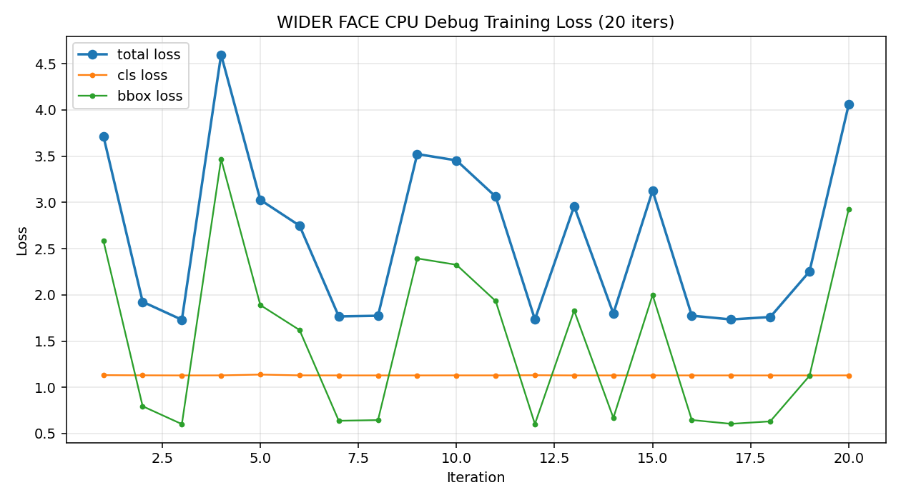
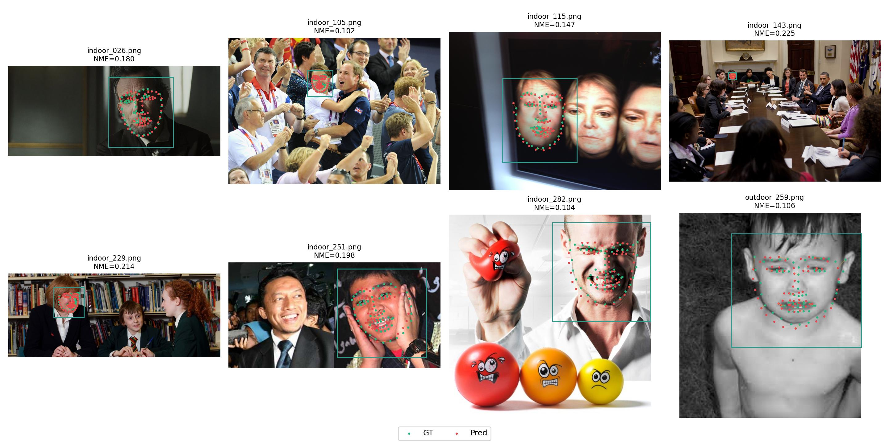
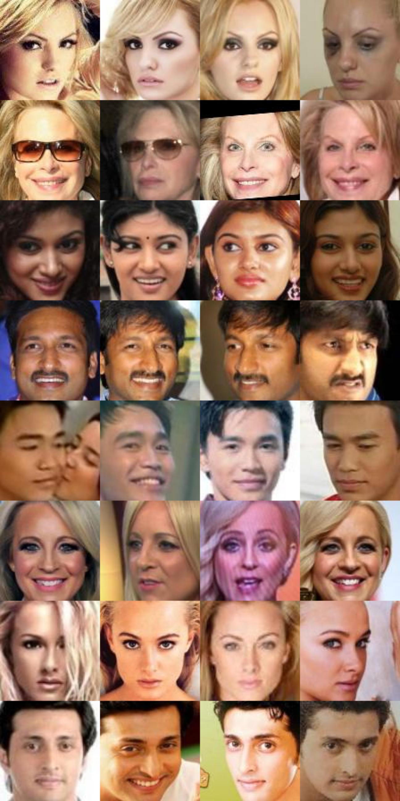
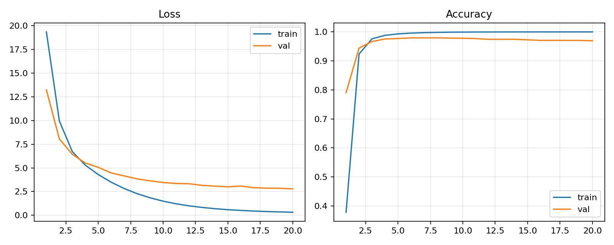

# 第三周总结：人脸检测模型训练与 WIDER FACE 实验推进

## 一、本周阶段目标

本周进入阶段二的第一部分，重点围绕“人脸检测模型训练”展开。根据实习任务要求，本周需要学习 MTCNN、RetinaFace 等人脸检测算法原理，使用 MMDetection 框架在 WIDER FACE 数据集上训练人脸检测模型，并在验证集上评估 mAP，同时在测试图像上展示检测结果。

本周的工作并不是只跑一个命令，而是完整经历了数据准备、环境兼容、训练稳定性排查、本地算力限制处理、checkpoint 可视化和验证集评估。虽然最终没有在本地完成长周期全量训练，但已经形成了可复现的 WIDER FACE 检测训练链路和阶段性评估结果。

## 二、本周完成的主要工作

- 学习并整理 MTCNN、RetinaFace 等人脸检测算法，理解级联检测、多尺度特征、anchor 机制、分类与边框回归等关键概念。
- 下载并转换 WIDER FACE 数据集，将原始标注整理为 MMDetection 可读取的数据格式。
- 构建 RetinaNet R50-FPN 人脸检测配置，并先后进行 smoke test、小规模 CPU debug 训练和 epoch_1 正式训练。
- 训练过程中遇到 `loss=nan` 问题，排查可能原因包括学习率、标注异常、边框数据、CPU 训练稳定性等，并调整训练配置继续运行。
- 在本地 CPU 满负载、温度较高的情况下，采用“跑完 epoch_1 自动停止”的策略，兼顾实验产出和硬件安全。
- 使用 debug checkpoint 和 epoch_1 checkpoint 做测试图检测可视化，观察检测框、重复框和定位偏移情况。
- 在 WIDER FACE 验证集上跑正式指标，得到 mAP/AP50 结果，完成阶段性交付。

## 三、实验结果

| 实验项目 | 设置 | 结果与结论 |
|---|---|---|
| WIDER FACE 数据检查 | 原始标注转换为 MMDetection 可用格式 | 数据路径、图片和标注可被训练脚本读取 |
| Smoke test | 小规模训练 | 验证配置、数据集和模型构建可运行 |
| CPU debug 训练 | 小规模 CPU 训练 | 用于排查 NaN、loss 曲线和 checkpoint 保存 |
| epoch_1 验证 | RetinaNet R50-FPN, `epoch_1.pth` | `pascal_voc/mAP=0.3283`, `AP50=0.328` |
| 测试图可视化 | 使用 epoch_1 checkpoint | 能检出人脸，但存在重复框和定位不稳 |

## 四、失败尝试与问题复盘

- **NaN loss 问题**：完整训练初期出现 `loss=nan`，说明检测模型训练对数据质量、学习率和标注格式较敏感。通过小规模 debug 训练定位问题，避免直接长时间跑错。
- **本地 CPU 负载过高**：训练过程中 CPU 负载达到 100%，温度约 80 摄氏度。本地硬件虽然能跑，但长时间满负荷不适合完整训练，因此采用 epoch_1 checkpoint 作为阶段性产出。
- **重复检测框问题**：测试图中同一张脸出现多个框，主要与训练轮次不足、分类置信度不稳定、边框回归尚未收敛和 NMS 阈值有关。
- **GPU/MMCV 兼容问题**：由于本机显卡和 PyTorch 版本较新，MMCV/MMDetection GPU 路线兼容成本较高，因此后续没有继续在本地强行跑 MMDetection 全量训练。

## 五、本周交付物

- `configs/mmdetection/widerface_retinanet_r50_fpn.py`
- `src/mmdetection/train_widerface.py`
- `src/mmdetection/evaluate_widerface.py`
- `outputs/reports/widerface_epoch1_eval_result.txt`
- `outputs/reports/widerface_*_stdout.log`
- `outputs/images/widerface_debug_loss_curve.png`

## 六、下周计划

下周转入人脸关键点检测与对齐任务，重点完成 300W 数据集检查、68 点关键点模型训练、NME 评估、五点提取和人脸对齐可视化。

---

# 第四周总结：人脸关键点检测、五点提取与对齐实验

## 一、本周阶段目标

本周围绕阶段二任务 4 展开，目标是在 300W 数据集上训练人脸关键点检测模型，实现 68 点预测，并进一步提取五点关键点，用于人脸仿射对齐。相比人脸检测，关键点任务更关注局部定位精度，因此本周的重点是模型训练、NME 指标、裁剪预处理和对齐效果分析。

## 二、本周完成的主要工作

- 学习 HRNet、SAN 等关键点检测方法，理解热力图回归、坐标回归和 NME 指标。
- 放置并检查 300W 数据集，确认图片和 68 点标注可读取。
- 训练基础关键点 CNN，完成第一版 68 点预测可视化。
- 发现基础模型在测试图上预测点偏移明显后，增加“按 GT bbox/landmark 外接框裁剪脸部再训练”的策略。
- 在裁剪版模型基础上加入数据增强，训练 30 epoch，并保存验证集 NME 最好的 checkpoint。
- 实现 68 点到五点的转换：左右眼中心、鼻尖、左右嘴角。
- 实现基于五点关键点的仿射变换人脸对齐，并输出对齐图。
- 完成 GT 五点对齐 vs 预测五点对齐对比，分析预测点误差对最终对齐的影响。
- 针对 300W/ArcFace 模板进行五点模板标定，分析通用 ArcFace 模板与当前数据集模板的差异。

## 三、实验结果

| 实验项目 | 设置 | 结果 |
|---|---|---|
| 300W 数据检查 | `data/raw/300W` | 样本与 68 点标注可读 |
| 基础关键点模型 | 原图训练 | 能输出关键点，但偏移明显 |
| 裁剪版关键点模型 | 按 GT landmark 外接框裁剪 | 关键点集中到脸部区域，定位稳定性提升 |
| 增强 30 epoch | 510 train / 90 val, CUDA, crop margin=0.25 | best epoch=29, best val NME=0.1721 |
| 五点对齐 | 68 点预测 -> 五点 -> 仿射变换 | 流程跑通，但预测五点不如 GT 五点稳定 |
| 模板标定 | ArcFace 模板 vs 300W 模板 | 发现模板差异会影响对齐视觉效果 |

## 四、失败尝试与问题复盘

- **原图训练偏移明显**：最初直接在原图上训练关键点模型，预测点偏移较大，说明背景、尺度变化和脸部位置差异会干扰坐标回归。
- **五点对齐不够齐**：即使 68 点预测总体可用，五点中的眼睛和嘴角误差仍会被仿射变换放大，导致对齐后视觉上不完全水平。
- **模板不匹配**：直接套用 ArcFace 五点模板并不总是适合 300W 标注分布，因此需要单独标定 300W/ArcFace 模板。
- **模型结构较轻量**：当前 CNN 能完成任务闭环，但 NME 仍有改进空间。后续可以尝试 HRNet、热力图监督或更多增强策略。

## 五、本周交付物

- `src/landmarks/check_300w_dataset.py`
- `src/landmarks/train_landmark_regressor.py`
- `src/landmarks/visualize_landmark_regressor.py`
- `src/landmarks/align_with_landmark_model.py`
- `outputs/reports/landmark_300w_aug30_training_result.txt`
- `outputs/landmarks/landmark_cnn_300w_aug30_predictions.jpg`
- `outputs/landmarks/alignment_compare_300w/gt_vs_pred_alignment_grid.jpg`
- `outputs/landmarks/calibrated_template_300w/arcface_vs_300w_template_alignment_grid.jpg`

## 六、下周计划

下周进入人脸识别模型训练任务，计划从 ResNet18 + ArcFace smoke baseline 开始，逐步扩展到 ResNet50、MS1M 子集和 LFW 6000 pairs / 10-fold 验证。

---

# 第五周总结：ArcFace 人脸识别模型训练、MS1M 子集构建与服务器复现实验

## 一、本周阶段目标

本周进入阶段二任务 5，目标是基于 ResNet 和 ArcFace 损失函数构建深度人脸识别模型，并在 LFW 数据集上验证准确率。本周工作量较大，既包括训练脚本开发，也包括 MS1M 子集构建、服务器环境使用、数据传输问题处理、标准 LFW 验证流程搭建和多组失败实验复盘。

## 二、本周完成的主要工作

- 实现统一 ArcFace 训练脚本，支持 ResNet18、ResNet50、IResNet50、MobileFaceNet。
- 支持 CelebA、folder 格式数据集和 MS1M 子集切换。
- 实现 LFW 6000 pairs / 10-fold 评估脚本，支持加载项目训练得到的 checkpoint。
- 先后完成 ResNet18 smoke baseline、CelebA 200/1000 身份、ImageNet pretrained ResNet50、MS1M 1000/5000/10000 身份训练实验。
- 编写 InsightFace/MXNet RecordIO 转身份文件夹脚本，将 faces_emore 处理为 1000、5000、10000 身份子集。
- 编写 MS1M aligned 112 预处理脚本，确认 10000 身份、300000 张图片全部为 112x112 aligned 人脸。
- 由于本地训练负载高、温度高，转向 AutoDL RTX 4090 服务器训练。
- 解决跨境上传慢、Google Drive/OneDrive 服务器不可达、压缩包格式错误、LFW 官网解析失败等工程问题。
- 在服务器上完成 ResNet50 + ArcFace 20 epoch 严格复现实验，并完成 LFW 标准验证。
- 尝试 IResNet50 + cosine + strong augment 改进训练，形成与 ResNet50 的对照实验。

## 三、数据集构建与预处理

| 数据阶段 | 规模 | 处理结果 |
|---|---|---|
| MS1M RecordIO 原始来源 | faces_emore，约 5,822,653 张图，85,742 身份 | 完成 RecordIO 读取和子集导出流程 |
| MS1M subset 1000 | 1000 身份，30000 张图 | 用于早期 baseline |
| MS1M subset 5000 | 5000 身份，150000 张图 | 用于扩大训练与策略探索 |
| MS1M subset 10000 | 10000 身份，300000 张图 | 最终服务器主训练数据 |
| Aligned 112 检查 | 300000 张图，全部 112x112 | Copied=300000, Resized=0, Unreadable=0 |

## 四、模型训练与 LFW 验证结果

| 实验 | 训练设置 | 训练验证集结果 | LFW 10-fold 结果 |
|---|---|---|---|
| ResNet18 smoke | 小规模 LFW/folder baseline | 流程跑通 | 约 0.62 |
| ResNet50 + CelebA1000 + ImageNet | CelebA 1000 身份，20 epoch | val_acc 约 0.7083 | DevTest 约 0.8080 |
| ResNet50 + MS1M 1000 aligned | 1000 身份，512 emb | best val_acc 约 0.7746 | 0.7027 |
| ResNet50 + MS1M 5000 aligned | 5000 身份，随机采样 | best val_acc 0.9497 | 0.7407 |
| ResNet50 + MS1M 10000 server | 10000 身份，20 epoch，batch 64 | best epoch 8, val_acc 0.9794 | 0.7698, 4619/6000 |
| IResNet50 + improved recipe | 10000 身份，cosine, strong augment, batch 128 | best epoch 18, val_acc 0.9892 | 0.6898, 4139/6000 |

## 五、失败尝试与问题复盘

- **本地训练压力过大**：IResNet50 多 epoch 训练时 CPU/GPU 长时间满负载且温度偏高，不适合继续本地跑大规模实验。
- **数据上传困难**：AutoDL 网页上传和 scp 在跨境链路下速度一度只有约 100KB/s，完整 faces_emore 难以上传。
- **海外网盘不可达**：Google Drive 与 OneDrive 在 AutoDL 国内服务器上不可达，报 `Network is unreachable`。
- **压缩格式问题**：手动打包 LFW 时一度把 RAR 文件命名为 zip，导致服务器 `unzip` 报 central directory 错误。
- **LFW 官方源解析失败**：UMass LFW 官网在服务器和本地均出现 DNS 解析问题，最终改用 HuggingFace 镜像下载 deepfunneled。
- **IResNet50 泛化下降**：IResNet50 训练验证集 val_acc 提升到 0.9892，但 LFW 只有 0.6898，说明训练集内指标不等于跨域泛化能力。
- **98.5% 目标差距**：当前自训练模型距离 98.5% 仍有明显差距，后续需要更大训练规模、人脸领域预训练 backbone 或更一致的人脸对齐流程。

## 六、本周交付物

- `src/recognition/train_arcface_celeba_subset.py`
- `src/recognition/evaluate_lfw_10fold_resnet_arcface.py`
- `src/datasets/convert_insightface_rec_to_folders.py`
- `src/datasets/prepare_ms1m_aligned_112.py`
- `models/checkpoints/resnet50_ms1m10000_reproduce_server_best.pt`
- `models/checkpoints/iresnet50_ms1m10000_cosine_server_best.pt`
- `outputs/reports/resnet50_ms1m10000_reproduce_server_result.txt`
- `outputs/reports/resnet50_ms1m10000_reproduce_server_lfw_10fold_result.txt`
- `outputs/reports/iresnet50_ms1m10000_cosine_server_lfw_10fold_result.txt`

## 七、下周计划

下周进入模型优化与部署准备，重点完成 PyTorch 动态量化、ONNX 导出、ONNXRuntime 推理测试和性能对比报告。

---

# 第六周总结：模型优化与部署准备

## 一、本周阶段目标

本周围绕阶段二任务 6 展开，目标是对已经训练好的 ResNet50 + ArcFace 人脸识别模型进行部署前优化。任务包括学习量化、剪枝、蒸馏等模型优化技术，使用 PyTorch 动态量化工具对模型进行量化，测试量化后的速度、大小和输出一致性，并将模型转换为 ONNX 格式进行 ONNXRuntime 推理测试。

## 二、本周完成的主要工作

- 学习模型量化、剪枝、蒸馏的基本思想和适用场景。
- 选择动态量化作为本周落地方案，原因是实现简单、适合 CPU 推理加速、可快速形成部署实验闭环。
- 编写 `src/optimization/quantize_arcface_model.py`，加载 ResNet50 + ArcFace checkpoint 并进行 qint8 动态量化。
- 保存量化后模型，并测试 FP32 与量化模型在随机输入上的输出一致性。
- 编写 `src/optimization/export_arcface_onnx.py`，导出 ONNX 模型并进行 ONNXRuntime 推理测试。
- 处理 ONNX 导出中的 Windows 编码问题，将 PyTorch 2.11 新 exporter 改为传统 exporter：`dynamo=False`。
- 生成动态量化报告和 ONNX 导出报告，形成任务 6 的完整交付物。

## 三、优化实验结果

| 优化项目 | 原始模型/框架 | 优化后 | 效果 |
|---|---|---|---|
| 模型大小 | FP32 checkpoint 114.09 MB | 动态量化模型 91.03 MB | 减少 20.21% |
| CPU 推理速度 | FP32 4.8014 ms/image | 动态量化 4.0888 ms/image | 1.174x 加速 |
| 输出一致性 | FP32 embedding | 量化 embedding | mean cosine 0.999670 |
| ONNX 模型大小 | PyTorch checkpoint | ONNX 93.61 MB | 形成可部署格式 |
| ONNXRuntime 推理 | PyTorch 4.8764 ms/image | ONNXRuntime 4.1690 ms/image | 1.170x 加速 |
| ONNX 输出一致性 | PyTorch embedding | ONNX embedding | mean cosine 1.000000 |

## 四、脚本与产物说明

- `src/optimization/quantize_arcface_model.py`：加载 ResNet50 ArcFace checkpoint，执行动态量化，输出量化模型和性能报告。
- `src/optimization/export_arcface_onnx.py`：加载同一 checkpoint，导出 ONNX，运行 ONNXRuntime 推理，并生成速度/一致性报告。
- `models/checkpoints/resnet50_ms1m10000_reproduce_server_dynamic_quantized.pt`：量化后模型。
- `models/exported/resnet50_ms1m10000_reproduce_server.onnx`：ONNX 模型。
- `outputs/reports/resnet50_ms1m10000_dynamic_quantization_report.txt/json`：量化实验报告。
- `outputs/reports/resnet50_ms1m10000_onnx_export_report.txt/json`：ONNX 导出与推理报告。

## 五、失败尝试与问题复盘

- **导入路径问题**：最初直接从子目录运行优化脚本时出现 `ModuleNotFoundError: No module named src`，原因是项目根目录没有加入 `PYTHONPATH`，后续在脚本中自动注入 `PROJECT_ROOT`。
- **ONNX 编码问题**：第一次 ONNX 导出失败并非模型结构错误，而是 PyTorch 新 exporter 在 Windows GBK 终端打印特殊符号导致 `UnicodeEncodeError`。
- **传统 exporter 修复**：改为 `torch.onnx.export(..., dynamo=False)` 后成功导出，说明部署脚本需要兼顾本地 Windows 工具链兼容性。
- **动态量化提升有限但稳定**：动态量化主要作用在 Linear 层，ResNet50 大量 Conv 层仍为 FP32，因此大小和速度提升有限，但输出一致性高，适合作为轻量部署 baseline。
- **ByteNN 可选项未接入**：当前没有真实 ByteNN 环境，暂未接入；后续可以将 ONNXRuntime 作为模拟推理引擎基线。

## 六、本周交付物对应实习任务

| 实习任务 | 完成情况 | 产物 |
|---|---|---|
| 任务 6.1：学习量化、剪枝和蒸馏 | 已完成基础学习和总结 | 本周报告与后续部署文档 |
| 任务 6.2：PyTorch 动态量化 | 已完成 | 量化脚本、量化模型、量化报告 |
| 任务 6.3：ONNX 转换与推理 | 已完成 | ONNX 脚本、ONNX 模型、ONNXRuntime 报告 |
| 任务 6.4：ByteNN 模拟 | 可选，暂未做 | 不影响必做交付 |

## 七、下周计划

- 补充 `docs/model_optimization_deployment.md`，把量化、剪枝、蒸馏、ONNX 和可选 ByteNN 统一整理成部署准备报告。
- 如果继续提升识别精度，优先考虑人脸领域 pretrained backbone、更大 MS1M 子集或更一致的 LFW 对齐流程。
- 准备阶段二总报告，将检测、关键点、识别、优化部署四条线汇总，突出成功结果、失败复盘和工程产出。
